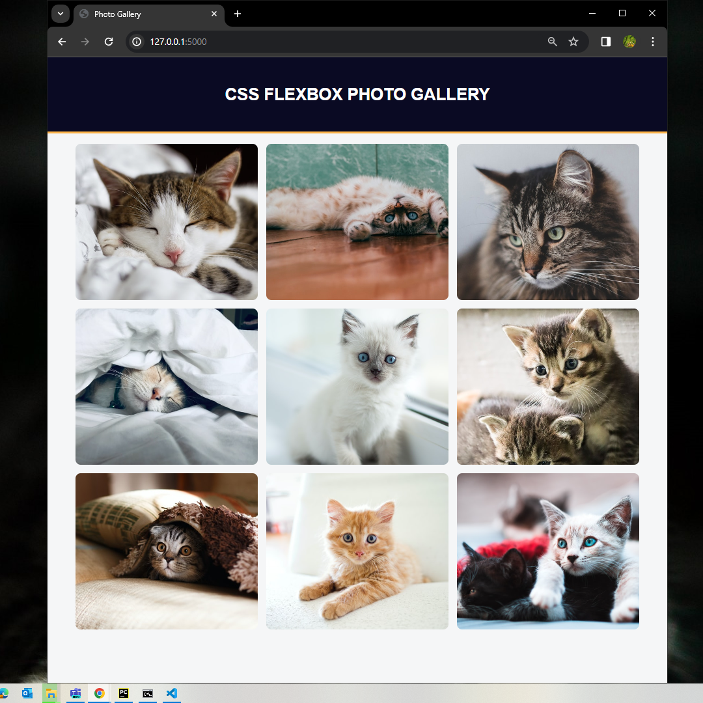

# CSS Flexbox Photo Gallery Project Documentation

## Overview

This project focuses on creating a responsive photo gallery using CSS Flexbox. The goal is to understand the `box-sizing` property, flex containers, and the flexbox layout model. The gallery will showcase images with different aspect ratios while ensuring proper spacing and alignment using flexbox properties.



### Box Sizing Property

Understanding how browsers calculate the size of container elements is crucial. The `box-sizing` property plays a key role. Two models are commonly used:

- **Content-Box Model:**
  - Default behavior where an element's width is calculated based only on its content. Padding and border values are added to the total width.
    ```css
    .element {
      box-sizing: content-box;
    }
    ```

- **Border-Box Model:**
  - The total width of the element, including padding and border, is explicitly set. The content shrinks to accommodate padding and border.
    ```css
    .element {
      box-sizing: border-box;
    }
    ```

### Flexbox Layout

Flexbox is a powerful one-dimensional layout model that controls the spacing and alignment of items within a container. Key concepts include:

- **Flex Container:**
  - Applied by giving an element a `display: flex` property. Direct children of a flex container are called flex items.
    ```css
    .container {
      display: flex;
    }
    ```

- **Main and Cross Axis:**
  - Determined by the `flex-direction` property. Main axis can be horizontal (`row`) or vertical (`column`), affecting the order of flex items.
    ```css
    .container {
      flex-direction: row; /* or column, row-reverse, column-reverse */
    }
    ```

- **Flex-Wrap:**
  - Controls how flex items behave when the container is too small. `wrap` allows items to wrap to the next row or column.
    ```css
    .container {
      flex-wrap: wrap; /* or nowrap (default) */
    }
    ```

- **Justify-Content:**
  - Positions items along the main axis, affecting their position and space around them.
    ```css
    .container {
      justify-content: space-between; /* or other values */
    }
    ```

- **Align-Items:**
  - Positions flex content along the cross axis, important when the flex direction is set to row.
    ```css
    .container {
      align-items: center; /* or other values */
    }
    ```

### Object-Fit Property

Images in the gallery have different aspect ratios. The `object-fit` property is used to determine how images should behave within their containers.
```css
img {
  object-fit: cover; /* or other values like contain */
}
```


### Gap Property

To provide space between images, the gap property is applied. It sets the gaps (gutters) between rows and columns in the flex container.

```css
.container {
  display: flex;
  gap: 10px; /* Adjust the value as needed */ 
}
```

### ::After Pseudo-Element

To push the last image to the left when the gallery is in a two-column layout, the `::after` pseudo-element is utilized. It creates an empty element after the last image.

```css
.container::after {
  content: "";
  width: 100%; /* Adjust the width to match the images */
}
```

## Conclusion

This CSS Flexbox Photo Gallery project demonstrates the effective use of flexbox properties to create a visually appealing and responsive gallery. The combination of box-sizing, flex containers, and related properties provides a flexible layout that adapts to different screen sizes and image aspect ratios. Developers can customize and expand this project to suit specific design requirements.