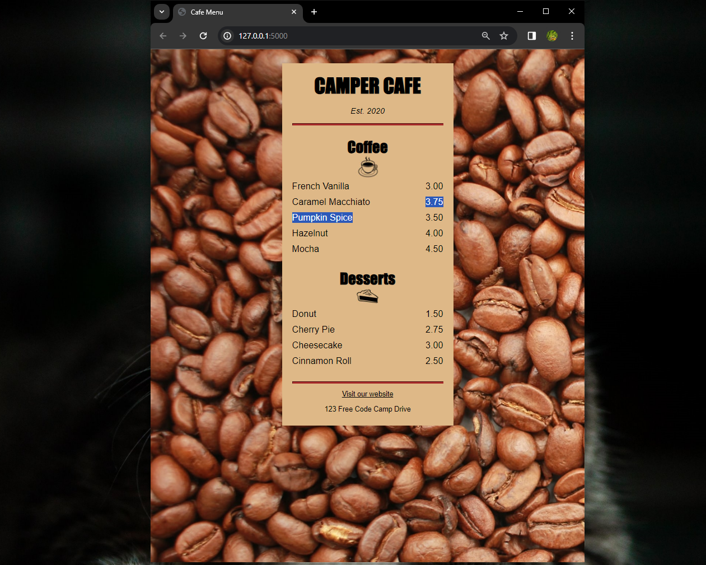

# Basic CSS: Cafe Menu Design

This project focuses on using CSS to create a stylish menu page for a cafe website. CSS (Cascading Style Sheets) is essential for controlling the presentation and layout of HTML elements.



## CSS Basics

- **Role of CSS:** Instructs the browser on how to display webpage elements, defining colors, fonts, and sizes.
- **Page Title:** Provides extra information for search engines and page display.
- **Div Element:** Used for design layout purposes.
- **Styling with Classes:** Apply styling using classes by adding a class attribute to the div element.
- **Article Elements:** Contain multiple items with related information for structured content.
- **Divider Usage:** Employ the `hr` element to create dividers between content sections.

## Applying Styles

### Syntax

Use the following syntax to apply styles:

```css
element {
  property: value;
}
```

For multiple elements, create a list of selectors:

```css
selector1, selector2 {
  property: value;
}
```

## CSS Comments
Use this syntax for comments:

```css
/* Comment Here */
```

## Class Selector

Define class selectors with a dot preceding the name:

```css
.class-name {
  styles
}
```

## External Style Sheets

For better organization, place styles in a separate file and link to it.

## Responsive Design
Ensure consistent styling on both desktop and mobile with a meta element.

## Centering Elements
To center an element horizontally, set margin-left and margin-right properties to auto.

## Link Styles
Change properties of a visited link using a pseudo-selector: a:visited { propertyName: propertyValue; }.
Change properties of a link on hover: a:hover { propertyName: propertyValue; }.
Change properties of a link when clicked: a:active { propertyName: propertyValue; }.