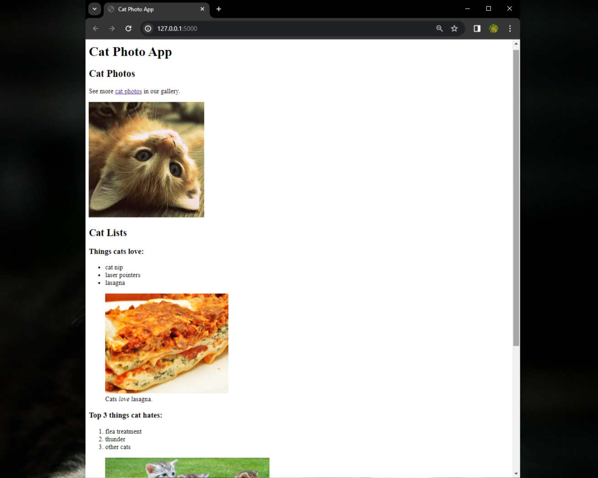
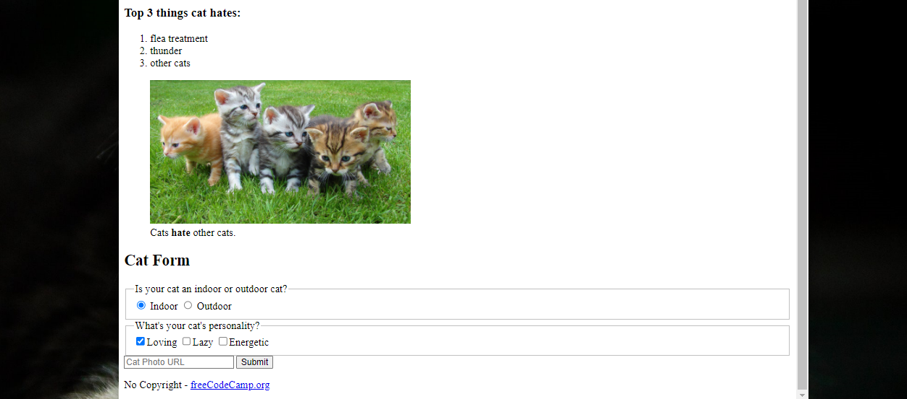

# Cat-Photo-App Readme

Welcome to the Cat-Photo-App documentation! This guide will help you understand the basics of HTML and provide instructions on building your own cat photo app.

 

## HTML Basics

HTML (Hypertext Markup Language) is the standard language for creating web pages. Here are some essential HTML elements and concepts you need to know:

1. **Heading Elements (`<h1>` to `<h6>`):**
   - HTML uses heading elements to define headings on a page. The importance decreases from `<h1>` to `<h6>`.
   - Use only one `<h1>` element per page and structure your headings hierarchically.

2. **Paragraph Element (`
`):**
   - The `
` element is used to create paragraphs of text on websites.

3. **Comments:**
   - HTML comments start with `<!--` and end with `-->`.
   - Example: `<!-- TODO: Remove h1 -->` is a comment indicating a task to be done.

4. **Main Content (`<main>`):**
   - The `<main>` tag specifies the main content of a document.
   - Content inside `<main>` should be unique to the document and not contain repeated content.

5. **Images (``):**
   - Add images to your website using the `` element.
   - Use the `src` attribute to specify the image's URL.

6. **Alt Attribute:**
   - All `` elements should have an `alt` attribute for accessibility.
   - Example: ``.

7. **Self-Closing Tags:**
   - Tags for elements without closing tags are known as self-closing tags.

8. **Links (`<a>`):**
   - Create links using the `<a>` element.
   - Link text is placed between the opening and closing tags.
   - Example: `<a href="https://www.freecodecamp.org">click here to go to freeCodeCamp.org</a>`.

9. **Target Attribute:**
   - Use the `target="_blank"` attribute to open a link in a new tab.

10. **Section Element (`<section>`):**
    - Use the `<section>` element to separate content, such as cat photos, from future content.

11. **Unordered List (`<ul>`) and List Item (`<li>`):**
    - Define unordered lists using the `<ul>` tag.
    - List items within `<ul>` are created using the `<li>` element.

12. **Figure Element (`<figure>`) and Figcaption (`<figcaption>`):**
    - The `<figure>` tag specifies self-contained content, like illustrations, diagrams, photos, code listings, etc.
    - Use `<figcaption>` to add a caption for the `<figure>` element.
    - Example: `<figure><figcaption>A cute cat</figcaption></figure>`.

13. **Emphasis Element (`<em>`):**
    - Emphasize text within the `<figcaption>` element using `<em>`.
    - Example: `<figcaption><em>Love</em> this cat!</figcaption>`.

14. **Ordered List (`<ol>`) and Strong Element (`<strong>`):**
    - Use `<ol>` for ordered lists.
    - The `<strong>` element indicates text of strong importance or urgency.

15. **Form Elements (`<form>`, `<input>`, `<button>`):**
    - The `<form>` element is used to create a web form.
    - Input elements collect data; they are self-closing and have various types.
    - Example: `<form action="/submit-url"><input type="text" name="email" placeholder="Email address" required><button>Submit</button></form>`.

16. **Radio Buttons (`<input type="radio">`):**
    - Use radio buttons for questions with one answer out of multiple options.
    - Example: `<label><input type="radio" name="answer" value="cat"> Cat</label>`.

17. **Fieldset (`<fieldset>`) and Legend (`<legend>`):**
    - `<fieldset>` groups related inputs and labels together.
    - `<legend>` provides a caption for the content in the `<fieldset>`.
    - Example: `<fieldset><legend>Choose Pet:</legend><label><input type="radio" name="pet" value="cat"> Cat</label><label><input type="radio" name="pet" value="dog"> Dog</label></fieldset>`.

18. **Checkboxes (`<input type="checkbox">`):**
    - Use checkboxes for questions with multiple answers.
    - Example: `<label><input type="checkbox" name="food" value="tacos"> Tacos</label>`.

19. **Title Element (`<title>`):**
    - The `<title>` element determines what browsers show in the title bar or tab for the page.
    - Example: `<title>Cat-Photo-App</title>`.

## Getting Started

Before adding new content, make use of the `<section>` element to organize your cat photos. Follow the provided guidelines for headings, paragraphs, images, links, and lists.

Feel free to explore and enhance your cat photo app by incorporating these HTML basics. Happy coding! 🐾📷
