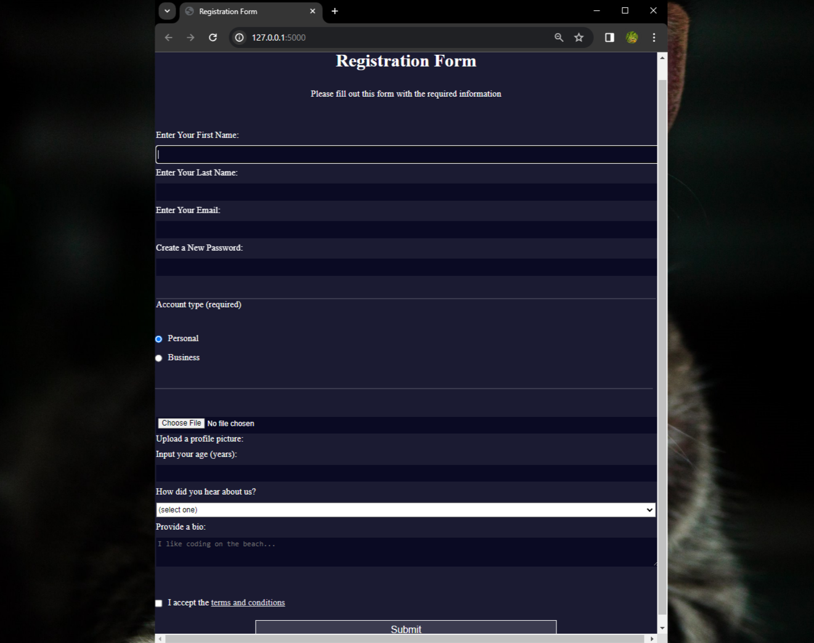

# Registration Form

You can use HTML forms to collect information from people who visit your webpage. In this project, I have build HTML forms by building a signup page. Learned how to control what types of data people can type into your form, and some new CSS tools for styling the page.

## Viewport Height (`vh`) and Root Em (`rem`)

- The `vh` unit stands for viewport height and is relative to 1% of the height of the viewport.
- The `rem` unit stands for root em and is relative to the font size of the HTML element.

## Styling Labels

- As `label` elements are inline by default, they are all displayed side by side on the same line.
- To make them appear on separate lines, add `display: block` to the `label` element and add a margin of `0.5rem 0` to separate them.

## Form Input Types

- The `type` attribute of a form element is crucial for the browser to understand what kind of data it should expect.
- If the `type` is not specified, the browser will default to text.
- For example, the `email` type only allows emails with `@` and `.` in the domain.
- The `password` type obscures the input and warns if the site does not use HTTPS.

## Submit Button

- The first `input` element with a type of `submit` is automatically set to submit its nearest parent form element.
- To handle the form submission, add an input element with `type="submit"` after the last `fieldset`.
- Certain `type` attribute values come with built-in form validation, like `type="email"`.

## Custom Validation

- Add custom validation to the password input element by adding a `minlength` attribute with a value of `8`.

## Radio Inputs

- Give radio inputs the same `name` attribute with a value of `account-type` to make them mutually exclusive.
- Provide context for radio inputs by adding a `legend` element with text "Account type (required)" before the label elements within the second `fieldset`.
- Add the `checked` attribute to the Personal input to ensure the form is submitted with the required data.

## Accessibility Best Practices

- Link input elements and label elements in the second `fieldset` for accessibility.

## File Upload

- Use the `input` type `file` to allow users to upload a profile picture.
- Add a label with the text "Upload a profile picture:" and nest an input accepting a file upload.

## Dropdowns

- Add a dropdown to the form with the `select` element.
- The `select` element is a container for a group of `option` elements.
- Each `option` needs a `value` attribute for useful server submission.

## Textarea

- The `textarea` element acts like an input element of type text but can receive multi-line text.
- Users can register with a bio, and a `placeholder` attribute is used for guidance.

## Form Submission

- Provide each submittable element with a `name` attribute for identification in form submission.

## Styling

- Style the last `fieldset` element using the `last-of-type` CSS pseudo-class, e.g., `p:last-of-type { }`.
- Style the submit button using an attribute selector, e.g., `input[name="password"]`.
