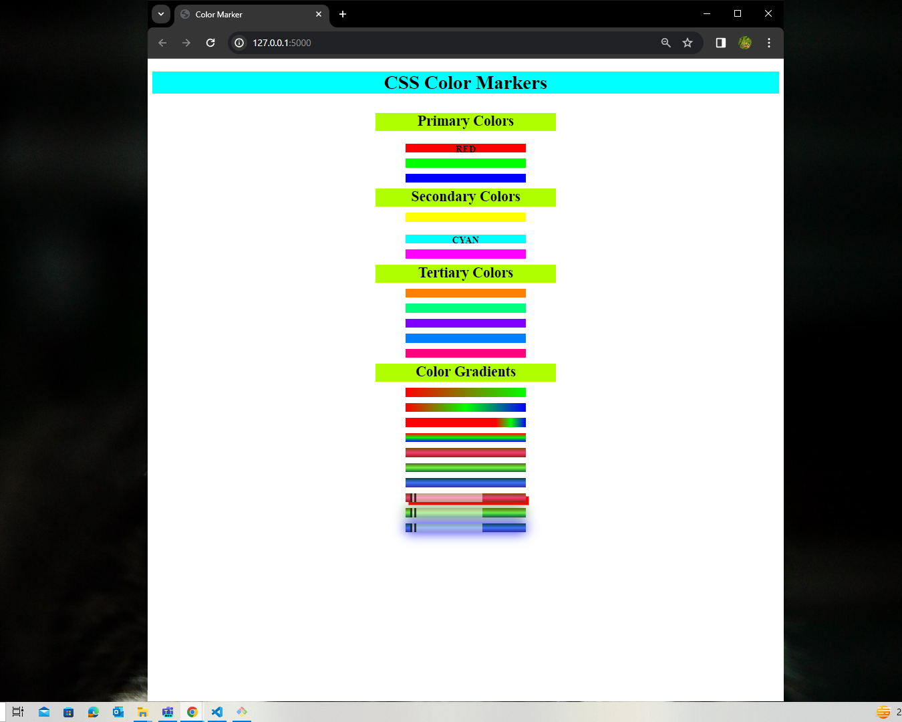

# Colored Markers CSS Project

Enhance the visual appeal of the webpage by implementing a set of colored markers using CSS. This project focuses on creating distinct and visually appealing markers through the use of various color techniques.

## Overview

Choosing the right colors for your webpage is crucial for improving its aesthetic appeal. The project involves creating colored markers with unique classes, adjusting spacing between markers, and applying different color models, such as RGB and HSL, to achieve the desired visual effects.



## Instructions

1. **Marker Spacing:**
   - Ensure that the three marker div elements are visually separated to enhance visibility and clarity. This can be achieved by adding appropriate margins or padding between the markers. For example:

     ```css
     .marker {
       margin-right: 10px;
     }
     ```

2. **Color Models:**
   - Explore and implement the RGB color model to create a range of colors for the markers. Understand that colors in this model are formed by combining levels of red, green, and blue. Experiment with different values for each color component to achieve a diverse set of colors. For example:

     ```css
     .red-marker {
       background-color: rgb(255, 0, 0);
     }
     ```

   - Familiarize yourself with primary, secondary, and tertiary colors within the RGB model. Tertiary colors can be created by combining a primary color with a nearby secondary color. For instance, combining red with yellow creates orange.

     ```css
     .orange-marker {
       background-color: rgb(255, 165, 0);
     }
     ```

3. **Color Wheel and Complementary Colors:**
   - Understand the concept of a color wheel and its significance in designing color combinations. Colors on the wheel are arranged based on similarity. Use the color wheel to guide your selection of complementary colors.
   - Identify complementary colors, which are opposite each other on the color wheel. Emphasize the visual contrast they create when placed together. Consider using complementary colors strategically to highlight specific elements on your webpage.

     ```css
     .complementary-marker {
       background-color: red;
       color: cyan; /* Complementary color to red */
     }
     ```

4. **Hexadecimal (Hex) Values:**
   - Learn and apply hexadecimal color values to set colors for elements. Hex values represent colors using a combination of numbers and letters. Experiment with different hex values to understand how they influence the color appearance. For example:

     ```css
     .green-marker {
       background-color: #00FF00;
     }
     ```

   - Understand the correspondence between hex values and RGB values, where 00 represents 0% intensity, and FF represents 100%.

5. **HSL Color Model:**
   - Explore the HSL color model, which represents colors based on hue, saturation, and lightness. The CSS hsl function accepts values for these attributes to define a color. Experiment with adjusting hue, saturation, and lightness values to create a diverse color palette.

     ```css
     .hsl-marker {
       background-color: hsl(120, 100%, 50%); /* Green color in HSL */
     }
     ```

   - Understand the role of hue (color), saturation (intensity), and lightness (brightness) in the HSL model. Use the HSL model as an alternative and complementary approach to defining colors in addition to the RGB model.

6. **Gradient and Color Stops:**
   - Implement color transitions or gradients using the linear-gradient function. This creates a smooth transition between two or more colors. Experiment with different gradient directions to achieve varying effects.

     ```css
     .gradient-marker {
       background: linear-gradient(to right, red, yellow, green);
     }
     ```

   - Utilize color stops to fine-tune where colors are placed along the gradient line. This allows for precise control over the gradient effect. For example:

     ```css
     .custom-gradient-marker {
       background: linear-gradient(to right, red 20%, yellow 50%, green 80%);
     }
     ```

7. **Opacity and Alpha Channel:**
   - Control the transparency of elements using the opacity property, ranging from 0% (completely transparent) to 100% (completely opaque). Experiment with different opacity values to achieve the desired level of transparency.

     ```css
     .transparent-marker {
       opacity: 0.7;
     }
     ```

   - Learn to use the alpha channel with the rgba function to set transparent colors. The alpha value controls the transparency level. For example:

     ```css
     .semi-transparent-marker {
       background-color: rgba(255, 0, 0, 0.5); /* Semi-transparent red */
     }
     ```

8. **Display Property and Borders:**
   - Set the display property of div elements to inline-block for positioning them on the same line. This prevents block-like stacking. Adjust the display property to achieve the desired layout for your markers.

     ```css
     .inline-marker {
       display: inline-block;
     }
     ```

   - Customize borders using the border-left shorthand property, specifying width, style, and color. For example:

     ```css
     .bordered-marker {
       border-left: 2px dashed #000;
     }
     ```

9. **Box Shadow:**
   - Apply shadows around elements using the box-shadow property. This adds depth and visual interest to elements on the page. Experiment with different values for offsetX, offsetY, blurRadius, and spreadRadius to achieve the desired shadow effect.

     ```css
     .shadowed-marker {
       box-shadow: 2px 2px 4px #888888;
     }
     ```

   - Understand the parameters of box-shadow, including offsetX, offsetY, blurRadius, and spreadRadius. Experiment with these values to achieve the desired shadow effect. For example:

     ```css
     .spread-shadow-marker {
       box-shadow: 2px 2px 4px 2px #888888;
     }
     ```

## Conclusion

By following these detailed instructions, you'll gain a comprehensive understanding of color models, coding techniques, and visual design principles. 

Feel free to use these examples as a reference for implementing concept in your CSS project.
