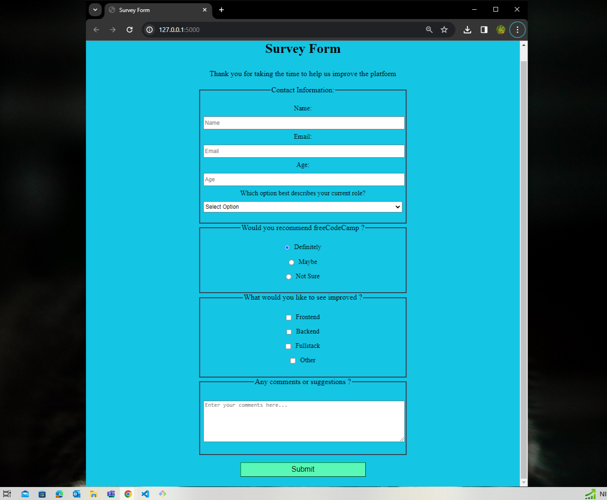

# Survey Form Project Documentation

## Overview

This project involves creating a responsive survey form using HTML and applying styles with CSS. The form aims to collect user information and opinions. The following documentation provides a breakdown of the key elements and their implementation.

## HTML Structure

The HTML structure consists of standard document elements, including doctype declaration, head, and body. Key components include:

- **Title and Meta Tags:**
  - Ensures proper rendering with the specified character set and viewport settings.

- **Survey Form:**
  - The main form is enclosed in the `<form>` element with the ID `survey-form`.

- **Fieldsets:**
  - Divided into logical sections with fieldsets such as Contact Information, Radio Buttons, Checkboxes, and Textarea.

- **Input Elements:**
  - Utilized for capturing user data, including text input for name and email, number input for age, dropdown for role selection, radio buttons for recommendations, checkboxes for improvement areas, and a textarea for comments.

- **Labels:**
  - Descriptive labels provide context for each input field, enhancing accessibility.

## CSS Styling

CSS styles have been applied to enhance the visual appeal and responsiveness of the survey form. Key styling includes:

- **Font Styling:**
  - Applied to the page title (`#title`) and description (`#description`) for a visually appealing header.

- **Form Styling:**
  - Adjusted spacing and layout for better visual organization.

- **Input Styling:**
  - Styled text inputs, email input, number input, select dropdown, radio buttons, checkboxes, and textarea for a cohesive look.

- **Fieldset Styling:**
  - Styled fieldsets to create visually distinct sections within the form.

- **Button Styling:**
  - Styled the submit button (`#submit`) for a polished appearance.

## User Stories Implementation

### Page Title and Description

- Implemented an `<h1>` element with the ID `title` for the page title.
- Added a `
` element with the ID `description` to provide a brief description.

### Form Structure and Inputs

- Created a `<form>` element with the ID `survey-form`.
- Implemented fieldsets to logically group related input elements.

### Input Validation

- Utilized HTML5 attributes (e.g., `required`, `type`, `min`, `max`) for input validation.
- Displays HTML5 validation errors for incorrect email format and number range.

### Labels and Placeholders

- Added descriptive labels for each input field to improve accessibility.
- Utilized placeholders to provide instructions or descriptions for the input fields.

### Select Dropdown, Radio Buttons, Checkboxes, and Textarea

- Included a select dropdown for role selection (`#dropdown`).
- Implemented radio buttons for the recommendation question.
- Utilized checkboxes for improvement areas.
- Provided a textarea for additional comments.

### Submit Button

- Created a submit button with the ID `submit` to submit the form.

## Conclusion

This survey form project successfully fulfills the specified user stories. The combination of HTML and CSS ensures a functional and visually appealing form, providing a seamless user experience. Developers can further customize and extend this project based on specific requirements.

Feel free to explore and modify the HTML and CSS code to suit your preferences or integrate additional features.
